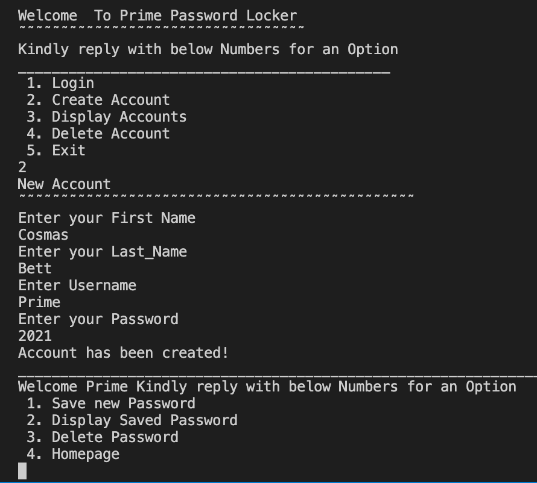

# Prime Password Locker

### About
This is Terminal application that is used to manage and even generate new passwords that a user has for various online accounts . It provide secure access to all the password information with the help of a master password. 
Latest version - 15th Jan 2022
#### By **Cosmas Bett**
## Description

### screenshot

### How to Clone and Operate this application,
 1. Open the terminal
 2. Paste this <strong> git clone https://github.com/CosBett/Prime-Password-Locker.git</strong>
3. Open and edit with a code editor of your preference.
4. Run $ #!/usr/bin/env python3.9
5. chmod +x run.py
6.  ./run.py

### Usage Instruction,
 The application is easy to use , after every stage it prompt you to input number option of your choice to be executed.

 Press 'Enter ' to submit the options

### Installation
This is a terminal application and there is no need of installation.

## Known Bugs
The application cannot store data at the moment.

## Technologies Used
1. Python3.9

## Support and contact details

Incase of any issues or clarification, development, ideas, concerns or contributions to the code.  Kindly reach out through my email cosmasbett9@gmail.com.
### License

* Copyright 2021 Cosmas Bett

Permission is hereby granted, free of charge, to any person obtaining a copy of this software and associated documentation files (the "Software"), to deal in the Software without restriction, including without limitation the rights to use, copy, modify, merge, publish, distribute, sublicense, and/or sell copies of the Software, and to permit persons to whom the Software is furnished to do so, subject to the following conditions:
The above copyright notice and this permission notice shall be included in all copies or substantial portions of the Software.
THE SOFTWARE IS PROVIDED "AS IS", WITHOUT WARRANTY OF ANY KIND, EXPRESS OR IMPLIED, INCLUDING BUT NOT LIMITED TO THE WARRANTIES OF MERCHANTABILITY, FITNESS FOR A PARTICULAR PURPOSE AND NONINFRINGEMENT. IN NO EVENT SHALL THE AUTHORS OR COPYRIGHT HOLDERS BE LIABLE FOR ANY CLAIM, DAMAGES OR OTHER LIABILITY, WHETHER IN AN ACTION OF CONTRACT, TORT OR OTHERWISE, ARISING FROM, OUT OF OR IN CONNECTION WITH THE SOFTWARE OR THE USE OR OTHER DEALINGS IN THE SOFTWARE.
*
Copyright (c) 2021 **Cosmas Bett**
  